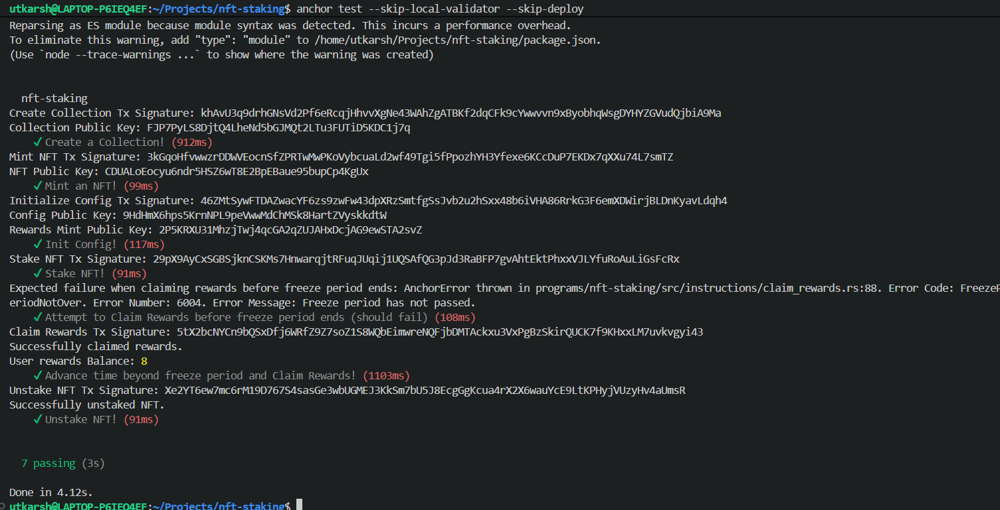

# NFT Staking Program

A secure and efficient Solana-based NFT staking protocol built with Anchor, enabling users to stake NFTs and earn rewards with configurable freeze periods and reward rates.

## Overview

This project implements a complete NFT staking ecosystem on Solana, leveraging the Metaplex Core standard for NFT management. Users can create NFT collections, mint assets, stake their NFTs to earn rewards, and claim rewards after a configurable freeze period.

### Key Features

- **Collection Management** - Create and manage NFT collections with customizable metadata
- **NFT Minting** - Mint NFTs within collections using the Metaplex Core standard
- **Staking Protocol** - Stake NFTs to earn configurable rewards
- **Reward System** - Earn rewards based on stake duration with BPS (basis points) configuration
- **Freeze Period** - Enforce freeze periods before rewards can be claimed, preventing gaming
- **Multi-Instruction Design** - Clean separation of concerns with modular instruction handlers

## Project Structure

```
programs/nft-staking/
├── src/
│   ├── lib.rs                 # Program entry point and instruction declarations
│   ├── constants.rs           # Program constants and configuration
│   ├── error.rs              # Custom error types
│   ├── instructions.rs       # Instruction module exports
│   ├── instructions/         # Individual instruction implementations
│   └── state/               # State management and PDAs
├── Cargo.toml               # Rust dependencies
└── tests/
    └── nft-staking.ts       # Comprehensive test suite
```

## Instructions

### `initialize`
Initializes the staking program configuration.

**Parameters:**
- `rewards_bps: u16` - Reward rate in basis points (100 BPS = 1%)
- `freeze_period: u16` - Freeze period in days before rewards can be claimed

### `create_collection`
Creates a new NFT collection.

**Parameters:**
- `name: String` - Collection name
- `uri: String` - Collection metadata URI

### `mint_asset`
Mints a new NFT within a collection.

**Parameters:**
- `name: String` - Asset name
- `uri: String` - Asset metadata URI

### `stake`
Stakes an NFT to begin earning rewards.

### `claim_rewards`
Claims accumulated rewards after the freeze period has elapsed.

**Validation:**
- Ensures freeze period has passed since staking
- Returns `AnchorError` with `FreezerPeriodNotOver` if claiming too early

### `unstake`
Unstakes an NFT and withdraws it from the protocol.

## Technology Stack

- **Anchor** - v0.31.1 - Rust framework for Solana program development
- **Solana** - Blockchain runtime and RPC
- **Metaplex Core** - v0.11.1 - Standard for digital asset management
- **Solana SPL Token** - Token program for reward distribution

## Development

### Prerequisites

- Rust 1.70+ with `solana` target
- Anchor CLI
- Node.js 18+ (for testing)
- pnpm (for package management)

### Setup

```bash
# Install dependencies
pnpm install

# Build the program
anchor build

# Run tests
anchor test --skip-local-validator --skip-deploy
```

### Testing

The project includes a comprehensive test suite covering:

 Collection creation
NFT minting  
Staking functionality
Reward claiming with freeze period validation
Unstaking operations

**Test Results:**



All 7 tests pass successfully in 3 seconds, demonstrating the robustness of the staking implementation.

## Configuration

The program uses two main configuration parameters:

| Parameter | Type | Description |
|-----------|------|-------------|
| `rewards_bps` | u16 | Reward rate in basis points (0-10000) |
| `freeze_period` | u16 | Days to wait before claiming rewards |

**Default Test Configuration:**
- Rewards: 10,000 BPS (100% annual yield)
- Freeze Period: 7 days

## Security Considerations

- **Freeze Period Enforcement** - Prevents immediate reward extraction and encourages long-term staking
- **PDA-Based Authority** - Uses derived update authorities for secure collection management
- **Anchor Security Framework** - Leverages Anchor's built-in protection mechanisms
- **Proper Error Handling** - Custom error types for clear failure diagnostics


